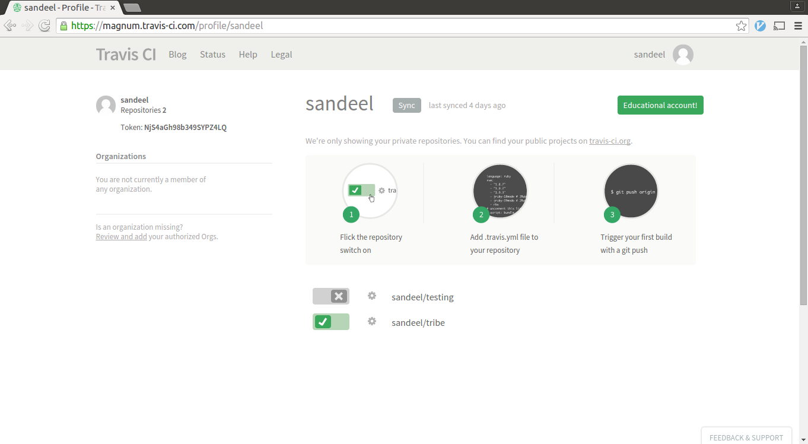
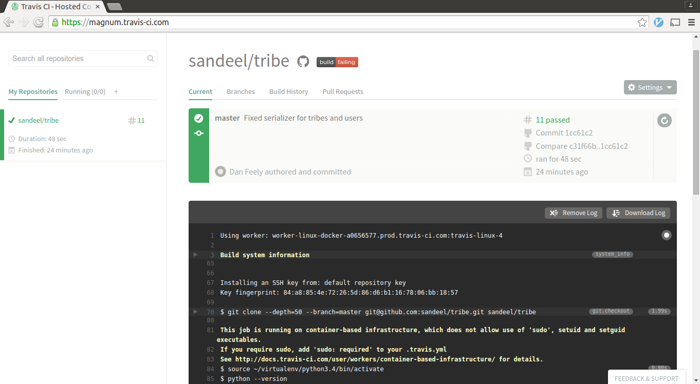
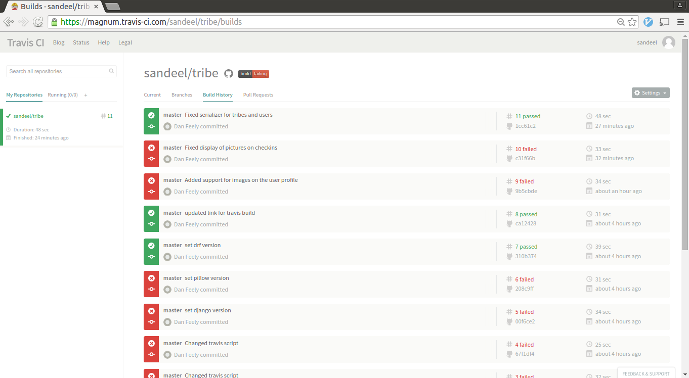

## Hosting with Digital Ocean

I needed to install git to clone my repository. This was done using Ubuntu's
apt-get package manager:

    apt-get update
    apt-get install git
    
I then cloned my repository:

    git clone https://github.com/sandeel/tribe.git

And changed into the directory for the Django project

    cd tribe/tribe

To install the python libraries needed, I first had to install Python's package
manager, PIP.

    apt-get install [[python-pip]]

And some Python development libraries:

    apt-get install python-dev

The requirements are stored in a text file called requirements.txt. PIP can parse
through this file and install all the dependencies:

    pip install -r requirements.txt

Then to run the development server for testing:

    python manage.py runserver 0.0.0.0:8000

## Continuous Integration

Travis CI was used.

https://travis-ci.com/

Travis CI is a web service which links to a Github account to provide continuous
integration. Travis CI is notified when your Github repository is updated and
then clones the repository and runs the instructions in the .travis.yml file
to download the required dependencies and run the tests for
your application.

I followed the following steps to set up Travis CI and activate continuous
integration with my project's repository.

I created a .travis.yml file in my repository's base directory. The travis.yml
had the following content:

I set the language to Python so Travis knows which interpreter to use.

    language: python
    
Tell Travis the Python version. This is very important as between Python versions
especially version 2 to 3 code may become invalid.
    
    python:
      - "3.4"
    
The following tells Travis to install the required libraries for my project. The
requirements.txt file is in the base folder of the repository and is simply a list
of my required libraries and their versions.

    install:
      - pip install -r tribe/requirements.txt
    
The next section tells Travis what it has to do to run my tests. Each line of 
this represents a command to be run.

    script:
      - cd tribe
      - python manage.py test

Signing up for a Travis account was quite straightforward. It is important to 
note that for my purposes travis-ci.com was used and not travis-ci.org, because
travis-ci.org only allows for public accounts and for academic purposes I needed
to keep my builds private.

I signed up for the free trial using my Github account. This was a one-click 
operation. I was then able to navigate to the billing settings and notify Travis
that I had a Github student account. Travis are part of this plan so I was
then allowed free access to a private account.

I was then able to switch on or off repositories from my Github account.

Travis-CI helpfully then sent me emails stating when my build had failed and
when it was fixed.

The build can be watched in real-time if you log into your Travis account and
then push to your Github repository.

There are also various tools available on Travis's web interface. One of the more
useful views I found was the "Build History" view.

I was also able to put a "light" on my repository's Github page which turned 
green when build was passing and red when build failing.

Overall I think that while using continuous integration didn't gain me a huge
amount because I was only a one-person team, it still had some benefits and didn't
take too much time to set up. It was also of benefit to learn this skill as I 
can see how continuous integration would be extremely useful in large teams who
are working together on a single codebase.
