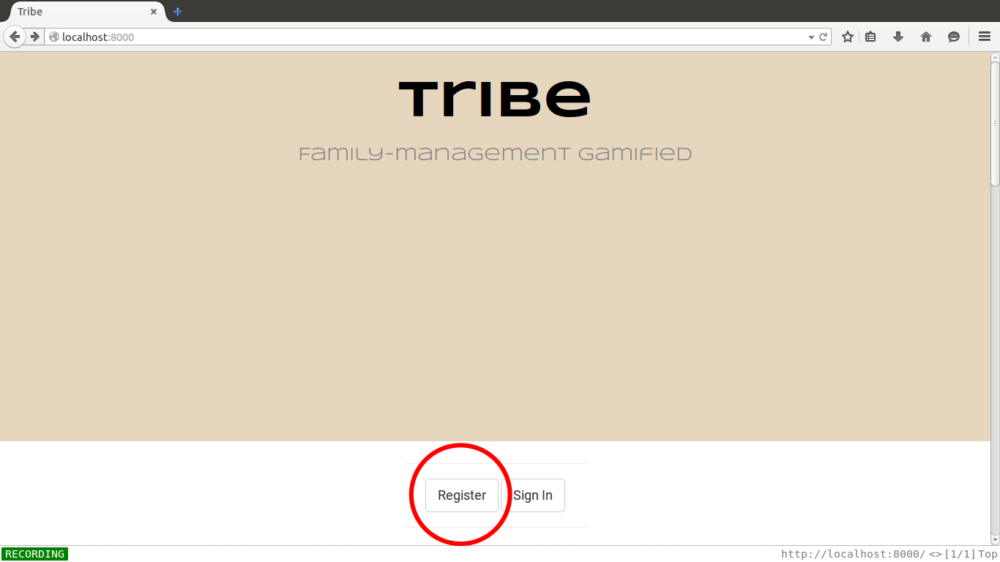

Overview
========

Tribe is an application for efficient families.

Each member of the family uses Tribe. Family members complete daily tasks to earn points which unlock rewards. 

## The Problem Tribe solves
* Kids need motivation to do homework and do tasks like cleaning their bedrooms
* Families are busy and find it hard to keep track of what other family members are doing and when
* Family members spend their days in different locations

## Aims of Tribe

**Motivation**
Create motivation for family members to work together on completing day-to-day tasks.

**Schoolwork**
Remind and encourage kids to complete homework.

**Accountability**
Allow parents to check that kids' homework has been done. Make sure everybody knows the dog has already been walked and fed.

**Family Interaction**
Encourage the family to spend time together and co-operate.

**Fun**
Give a sense of satisfaction and joint achievement and add a fun element to day-to-day tasks.

\pagebreak

Requirements Specification
=================

## Overview of the application

Each member of the family who is signed up to Tribe becomes a "tribe member".

A parent, (or both parents, or even an older child or child minder) becomes the "tribe leader".

### Tasks

Tribe leaders create tasks.

Tasks can be once-off or recurring, eg. daily tasks ("do homework") or weekly tasks ("take out bins").

Tribe members complete tasks, and mark them as "done" using either the web interface or mobile app. Optionally a photo can be uploaded as proof that the task has been completed.

### Points

A Tribe Leader confirms that the task has been done and the points are awarded to the Tribe as a whole.

The accumulated points are visible to all tribe members.

### Rewards

If the tribe scores enough points in a given week, rewards are unlocked. Rewards are in "levels" eg., the Level 1 rewards might be unlocked after 100 points, Level 2 after 200, and so on.

Rewards are set by a tribe leader, and are specific to tribe members. For example, for parents the Level 1 reward might be a bottle of wine or cinema trip. For the older kids, the equivalent reward might be pocket money or phone top-up. For the youngest kid, it might be sweets. It is up to the tribe leader to ensure the rewards are roughly equal in value. All tribe members can view what rewards (for both themselves and other tribe members) are available for each level on a given week.

Tribe has a selection of default rewards to choose from, however the Tribe leaders have the option to customise the rewards.

Sample rewards for kids are

* amounts of pocket money (a multiplier system is available to award appropriate levels of pocket money based on the kids' ages)
* phone top-up credit
* presents (eg. a toy, new phone)

### Categories
Tasks can fit into a category.

Information about how many points have been scored in a certain category are available, giving the Tribe an idea of where they are doing well and where improvements are needed.

Tribe provides several categories by default:

* Household
* Diet
* Fitness
* Pets
* Learning and School

\pagebreak

## Use Case diagram

**Tribe Leader**: This is usually a parent but can be any tribe member (eg. babysitter)  
**Tribe Member**: Any member of the family/tribe who has signed up  
**Admin**: The administrator of a Tribe instance (server, database administrator etc.)

\pagebreak

## User Stories

**As a new user I want to read information about Tribe as I am thinking about signing up**

***

**User Story: As a new user I want to sign up to Tribe so that I can organise my family or because I have been invited to an existing Tribe**

Data required:

* email address
* name
* family name
* password

**User Story: As a Tribe Leader I want to add my family members to the tribe because I want to have my whole family set up using Tribe**

Data required:

* email address

**User Story: As a Tribe Member I want to sign in so I can use features of Tribe**

* email
* password

**As a Tribe Member I want to edit my profile because I want to add details about myself and choose a picture.**

* name
* image

***

**As a Tribe Leader I want to add, edit, or delete a task because I have thought of a new task that needs to be done or one that needs to be changed**

* task name
* description
* task category
* number of points rewarded for completing the task
* availability details
* assigned Tribe Members

***

**As a Tribe Member I want to see a list of tasks currently avalable to me because I want to earn points**

* task details
* points reward

***

**As a Tribe Member I want to mark a task as done because I have completed a task and want to earn points for it.**

***

**As a Tribe Member I want to see the number of points my tribe has accumulated this week because I want to see how close we are to winning a reward.**

***

**As a Tribe Member I want to see the number of points my tribe has accumulated overall for motivation**

***

**As a Tribe Member I want to see how many points the tribe has accumulated on a per-day basis because I want to see which days we are better on**

***

**As a Tribe Leader I want to create, edit or delete a reward which can be won by Tribe Members because I want to create incentives**

* reward name
* image
* optional description

***

**As a Tribe Leader I want to create a new Category or edit existing Categories because I want points to control how points are tracked.**

* name
* optional description

***

**As a Tribe Member I want to view my or another Tribe Member's profile because I want to see how they are doing and see what Rewards they have gained**

* name
* stats on points and tasks
* rewards gained

***

**As a Tribe Member or Tribe Leader I want to be able to do all of the above using the REST API to allow for new clients and flexibility**

***

**As an Admin of Tribe I want to be able to modify any of the above entities using an administration interface**

***

\pagebreak

## Entity Relationship diagram

\pagebreak

# Technical Report

## Source Control

## Agile
### Taiga.io

## Testing
### My tests
...

### Continuous Integration

Travis CI was used.

https://travis-ci.com/

Travis CI is a web service which links to a Github account to provide continuous
integration. Travis CI is notified when your Github repository is updated and
then clones the repository and runs the instructions in the .travis.yml file
to download the required dependencies and run the tests for
your application.

I followed the following steps to set up Travis CI and activate continuous
integration with my project's repository.

I created a .travis.yml file in my repository's base directory. The travis.yml
had the following content:

I set the language to Python so Travis knows which interpreter to use.

    language: python
    
Tell Travis the Python version. This is very important as between Python versions
especially version 2 to 3 code may become invalid.
    
    python:
      - "3.4"
    
The following tells Travis to install the required libraries for my project. The
requirements.txt file is in the base folder of the repository and is simply a list
of my required libraries and their versions.

    install:
      - pip install -r tribe/requirements.txt
    
The next section tells Travis what it has to do to run my tests. Each line of 
this represents a command to be run.

    script:
      - cd tribe
      - python manage.py test

Signing up for a Travis account was quite straightforward. It is important to 
note that for my purposes travis-ci.com was used and not travis-ci.org, because
travis-ci.org only allows for public accounts and for academic purposes I needed
to keep my builds private.

I signed up for the free trial using my Github account. This was a one-click 
operation. I was then able to navigate to the billing settings and notify Travis
that I had a Github student account. Travis are part of this plan so I was
then allowed free access to a private account.

I was then able to switch on or off repositories from my Github account.

Travis-CI helpfully then sent me emails stating when my build had failed and
when it was fixed.

The build can be watched in real-time if you log into your Travis account and
then push to your Github repository.

There are also various tools available on Travis's web interface. One of the more
useful views I found was the "Build History" view.

I was also able to put a "light" on my repository's Github page which turned 
green when build was passing and red when build failing.

Overall I think that while using continuous integration didn't gain me a huge
amount because I was only a one-person team, it still had some benefits and didn't
take too much time to set up. It was also of benefit to learn this skill as I 
can see how continuous integration would be extremely useful in large teams who
are working together on a single codebase.

## Deployment

----- why was do chosen

I needed to install git to clone my repository. This was done using Ubuntu's
apt-get package manager:

    apt-get update
    apt-get install git
    
I then cloned my repository:

    git clone https://github.com/sandeel/tribe.git

And changed into the directory for the Django project

    cd tribe/tribe

To install the python libraries needed, I first had to install Python's package
manager, PIP.

    apt-get install [[python-pip]]

And some Python development libraries:

    apt-get install python-dev

The requirements are stored in a text file called requirements.txt. PIP can parse
through this file and install all the dependencies:

    pip install -r requirements.txt

Then to run the development server for testing:

    python manage.py runserver 0.0.0.0:8000

## Timeline

2014-12-08

* Came up with a name for the application
* Created the git repo locally and on Github
* Researched several different time-tracking and AGILE solutions
* Decided to go with Taiga.io
* Created a project for tribe on Taiga.io
* Created some initial user stories on Taiga.io

2014-12-12

* Created Powerpoint slides for the mid-point presentation 
* Put together a very rough demo of the application using Django

2014-12-13

* Presented the idea and received feedback from Eamonn

2014-12-14

* Put together my Requirements Specification document
* Submitted the Requirement Specification to Moodle
* Emailed supervisor my Requirement Specification requesting feedback
* Started putting all user stories from requirements into Taiga.io
* Creating a list of all entities in the system

2014-12-16

* Started coding the basics of the system, eg. user accounts, log-in
* Created directory layout, code repository, etc.

2014-12-17

* More work on the system basics
* Began researching Django REST Framework and reading the documentation

2014-12-18

* Completed the tutorial for the Django Rest Framework: http://www.django-rest-framework.org/tutorial/
* Researched the HTTPie tool https://github.com/jakubroztocil/httpie as a means of testing my REST API

### Sprint 1: Users and Tribes (28th Dec 2014 - 11th Jan 2015)

2014-12-28

* Mapped out 10 sprints in detail on Taiga.io leading up to project completion date

2014-12-29

* Continued tutorial on Django Rest Framework
* Began to prepare the project documentation

2014-12-30

* Completed the tutorial on Django Rest Framework

2014-12-31

* Researching and mapping out permissions in the Django Rest Framework
* Created permission for allowing unregistered users to create a new user (eg. for registering via mobile app)

2015-01-01

* Almost completed sign up new user by API

2015-01-02

* Completed sign up via API and also implemented creating a tribe via the API

2015-01-04

* Started to implement inviting new users.

2015-01-10

* Working on adding new users to a Tribe. Almost ready for test.
* Uploaded December diary to Moodle

2015-01-11

* Finished form for adding a new tribe member to your tribe
* Wrote unit test for above functionality

### Sprint 2: Tasks and Categories (12th Jan 2015 - 25th Jan 2015)

2015-01-12

* Added models for Tasks and Categories.
* Added a view for Task

2015-01-14

* Working on the models/database tables for Task
* Form for new Task

2015-01-14

* Forms for editing Tasks and viewing details.

2015-01-20

* Added models, forms, views etc. for Categories
* Added some more user stories to Taiga.io project
* Got most of the user stories laid out in sprints in Taiga.io

2015-01-21

* Created an API serializer for Categories
* Created API endpoint for creating and viewing categories
* Wrote tests for creating Categories via API

2015-01-22

* Created a serializer for Task
* Created API endpoints for Task

2015-01-25

* Started refactoring the code so that the forms use the app's own API

### Sprint 3: Task Completion (26th Jan 2015 - 08th Feb 2015)

2015-01-26

* Created CheckIn class.

2015-01-28

* Added a "Check In" button to tasks which creates an instance of a check in for a user on that task and awards points. This uses the API in the background.

2015-01-31

* Created an approvals system for tribe leaders to approve tasks
* Started working on some test/example data

2015-02-01

* Wrote several more tests

2015-02-02

* Wrote more tests
* Investigating and reading about Apache Cordova for mobile app
* Started working on the mobile app.
* Researching Ngrok to publicly host the site for the app to communicate with.

2015-02-03

* Working more on the mobile app and working on styling to ensure site looks ok on both mobile and desktop
* Added basic points calculation for users (done by counting up the points awarded for each checkin which has been approved)

2015-02-04

* Redesigned home page and user interface (prototype design for finished product). Started CSS style sheet for site.
* Changed permissions for some views eg. Task list.

2015-02-05

* Investigated continuous integration service Travis CI.
* Created account with travis and config file to tell it how to test my code
* Builds passing. Added small button to my project's github page to indicated if builds are passing or not.
* Added a collapsible navigation sidebar to the site. Ensured it also works on mobile

### Sprint 4: Points System (10th February - 22nd February 2015)

2015-02-17

* Created calculation methods for total points for a Tribe. (still need to write
tests for these)
* Created a display for these points on a per-day basis on the points page

### Sprint 5 "Rewards"

2015-02-24
* Created a model for a reward
* Created serializer for a reward
* Created views for adding rewards

2015-02-26
* Created views for editing rewards
* Researching drawing graphs in HTML5
* Researching the native Progress element in HTML5
* Added a basic progress bar for weekly points using bootstrap for the styles

2015-03-10
* Revamped the UI

2015-03-11
* Working on rewards and points required for rewards
* rewards can now be assigned to users

2015-03-14
* Changes to the user model. New users now need a Name
* Added tests to ensure new users have names and get a default tribe created
* Researched testing JSON responses
* Started to create a test family which gets created by a script (for test data)
* Worked a lot on created test data. To do this I had to make tweaks to some models
* Redesigning the tasks page

2015-03-18
* Researching Django Crispy Forms
* Designed the login page

2015-03-19
* Working on the points page. Now shows the rewards and a users progress towards rewards.
* Points page now shows points today, this week, and total points.
* Still working on the script for making fake data. Much more useful now as makes use
of a Python fake data generator which creates random users, tasks and rewards.

2015-03-20
* Working on the user's profile page.
* Changes to form for editing user.

2015-03-22
* Working on progress bars for rewards on the points page.

2015-03-23
* More work on the models for Rewards and Achieved rewards.
* Points page now shows complete when reward achieved.
* Achieved rewards now show on the user's homepage
* Changes to the test data generator

2015-04-16
* uploaded showcase information

2015-04-18
* Worked on getting tests working with Travis-CI
* Added user photo support
* Redesigned profile page to allow for photos

2015-04-25
* Styled the sign-up page
* Added to the script for creating test data
* Changes to Tribe management

2015-05-02
* Changed some styling
* Changes to the points page

2015-05-03
* 

2015-05-05
* Redesigned the tasks page
* Split tasks out into categories
* Implemented bootstrap accordion

2015-05-06
* Redesigning a lot of the interface
* Modifying the stylesheets to add colour
* Working on the documentation

2015-05-07
* Added the promotional text to the homepage

# User Manual

## Web interface

### Registration

When first accessing the web interface, the user will be presented with the home
page. Scrolling down here will give an overview of the application so the user
can decide if they want to sign up.

To register as a new user, click the register button. This will present the
registration page.

Fill in the required information on the registration page. You will need to 
enter an email address, name and password.

If any of the information is invalid
the user interface will alert you and not allow you to progress.

You will then be prompted to enter the name of your "tribe" (family or group).

## Mobile App
## REST API

